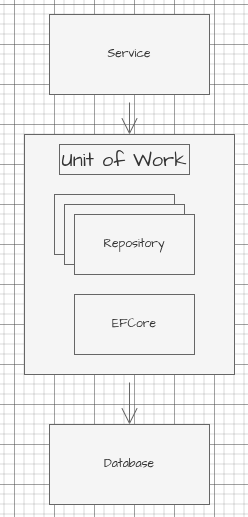
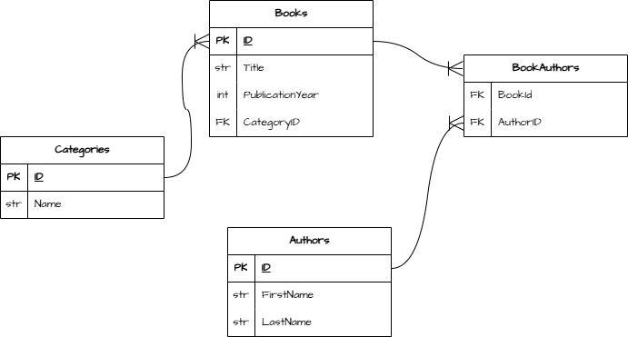

# Project
Simple EFCore + MySQL project to practice code-first approach and linq with C# and .NET 9.

# Approach
We are using a code-first approach, with a simple services class instead of using the repository pattern.

There is a reason for why Im choosing not to implement my own repository pattern, and that is that Entity Framework Core has its own implementation through:
- **Unit of Work** - [DbContext](https://learn.microsoft.com/en-us/dotnet/api/microsoft.entityframeworkcore.dbcontext?view=efcore-10.0).
- **Repository** [DbSet](https://learn.microsoft.com/en-us/dotnet/api/microsoft.entityframeworkcore.dbset-1?view=efcore-10.0).

To refresh our understanding of the concept of the repository pattern, lets clarify its purpose
- To act as an abstraction layer between the `domain layer` (application) and `data access` (database).
- Common methods implemented in a repository are `CRUD` methods.

- **DbContext** - Implements Unit Of Work, which is just a centralized class for changes to be added to the database (it tracks changes, manages transactions/connections, and coordinates `SaveChanges()`).
- **DbSet** - Acts as a repository in a way that it treats the external database entity models as if it were in-memory collections. It allows us developers to interact with the models in plain C# by reading models (and including relationships), creating records, deleting and updating.
    - Implements [IQueryable<T>](https://learn.microsoft.com/en-us/dotnet/api/system.linq.iqueryable-1?view=net-10.0) which is an Interface that evaluates queries and translates them to a specific data source language such as `SQL`.
    - Its important to know that `DbSet` does not load everything into memory unless we enumerate the query, that is where `IQueryable<T>` comes in.
        - `IQueryable<T>` builds an expression tree (blueprint) and ony loads data into memory when we execute `ToList`, `Single`, `FirstOrDefault` etc.
            - At which point the query becomes an `IEnumerable<T>`.

- **Services** - Including the Unit Of Work (`DbContext`) in a service allows us to focus on LINQ composition.
    - 

To see an example of the **Repository Pattern** implemented on top of Entity Framework Core have a look at my other repo [here](https://github.com/yosang/csharp-efcore-code-first).

# Steps
- [x] - Design logical entity model (`draw.io`)
    - Relationships:
        - Categories - Books (One-To-Many)
        - Books - Authors (Many-To-Many)
- [x] - Create entity models
- [x] - Create a database in mysql and a user with permissions
- [x] - Install required packages
    - `MySql.EntityFrameworkCore` (MySql library for EFCore)
    - `Microsoft.EntityFrameworkCore.Design --version 9.*` (Migrations) (Major version must match our .NET 9 version)
- [x] - Setup model classes
- [x] - Setup `DbContext` derived class with `DbSet` propertjies.
    - [x] - Configure connection string
    - [x] - Configure model constraints
    - [x] - Configure relationships
    - [ ] - Configure seeds
- [x] - Setup migrations
    - [x] - Update database through migrations
- [ ] - Setup services
    - [x] - Setup a minimal working method/'s
    - [ ] - Setup basic CRUD operations
- [ ] - Setup some fancy LINQ methods

# ERD

# About
[Yosmel Chiang](https://github.com/yosang)
